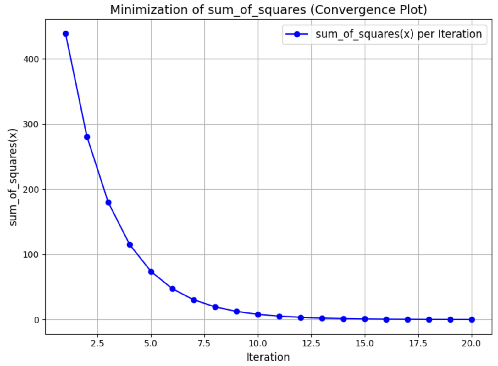

# mini-autograd
A mini deep learning library with an automatic differentiation engine for tensors. This library implements backpropagation over a dynamically constructed DAG, along with a lightweight neural networks module.

### Setup (Recommended to use Python version : 3.9.20)
#### Step 1: It's recommended to use Python version 3.9.20. You can use [pyenv](https://github.com/pyenv/pyenv) to manage Python versions and virtual environments.

#### Step 2: Create a virtual environment at the project root.
```bash
pyenv virtualenv env-3.9.20
```

#### Step 3: Install all dependencies needed.
```bash
pip install -r requirements.txt
```

#### Step 4: Sanity Check (pytest)
```bash
pytest -s
```

#### Note: In order to test the project you can individually run the *.ipynb files and see the implementation in action.

### Tensor Operations
[Forward & Backward Pass](https://github.com/sagnikpal10/mini-autograd/blob/main/tensor-operations.ipynb)
```python3
from autograd.tensor import Tensor
from autograd.functions import pow

a = Tensor([[1, 2, 3], [4, 5, 6]], requires_grad=True)
b = Tensor([[10, 20, 30], [41, 51, 61]], requires_grad=True)
c = a + b
d = Tensor([[1, 2, 1], [1, 1, 2]], requires_grad=True)
e = c * d - a
f = Tensor([[-1.0, 1.0], [2.0, -1.0], [-1.9, 1.0]], requires_grad=True)
h = pow(e @ f, 2)
h.backward(Tensor([[-1.0, 1.0], [2.0, -1.0]]))
result = [[round(float(x), 3) for x in row ] for row in h.data]
da = [[round(float(x), 3) for x in row ] for row in a.grad.data]

print("Forward Pass via custom autograd engine", result)
print("Back-propagation dh/da (Project)", da)

```

### Minimizing a function using gradient descent
[Minimizing a function](https://github.com/sagnikpal10/mini-autograd/blob/main/minimize-function.ipynb)
```python3
from autograd.tensor import Tensor
import numpy as np

x = Tensor([12, 0, 11, 5, 8, -9, 2], requires_grad=True) # initialization
print(sum_of_squares(x).data)

y_vals = []

for i in range(20):
    x.zero_grad()

    y = sum_of_squares(x)
    y.backward()

    delta_x = Tensor(0.1) * x.grad
    x = x - delta_x

    y_vals.append(y.data)
```

#### Convergence of minimum


### Training a neural netork
[Simple Neural Network Training](https://github.com/sagnikpal10/mini-autograd/blob/main/neural-network-demo.ipynb)
```python3
from autograd.tensor import Tensor, Parameter
from nn.optimizer import SGD
from nn.module import Module

class Model(Module):
    def __init__(self) -> None:
        self.w = Parameter(3)
        self.b = Parameter()

    def predict(self, inputs: Tensor) -> Tensor:
        return inputs @ self.w + self.b

optimizer = SGD(lr=0.001)
batch_size = 32
model = Model()
```
